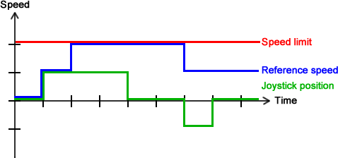

# Train Speed Controller

This is a sample application for the verification laboratory.

## Getting started

* The application is implemented in Java.
* The project can be built using [Gradle](https://gradle.org/) or [Maven](https://maven.apache.org/) (currently **Maven** is preferred).
* [JUnit](https://junit.org/junit5/) is used for tests.

### Maven
Clone the repository and execute Maven to build the application:

```
mvn compile
```

To compile and run tests also execute:

```
mvn test
```

(That will be enough to know for the current exercises. If you are more interested, see [this](https://github.com/ftsrg-edu/swsv-labs/wiki/0b-Build-tools) short guide about Maven.)

### Gradle
Clone the repository and execute Gradle to build the application:

```
./gradlew build
```

To compile and run tests also execute:

```
./gradlew test
```

## Overview

### Structure

The application represents a simple train controller system with the following three components.

* Sensor: The sensor can detect the change in the speed limit of the track and can signal in such cases to the controller.
* Controller: The controller is responsible for controlling the reference speed of the train. The reference speed is set by the user, but the speed limit must also be kept.
* User: The user can manipulate the reference speed of the train using a joystick.

### Behavior

Setting the reference speed of the train works in the following way.
* The user can set the position of a joystick, which can be zero or a positive/negative number.
* In each time unit, the controller adds the position of the joystick to the current reference speed. Therefore the reference speed does not change if the position is zero, it is incremented if the position is positive and it is decremented if the position is negative.
* After each change, the speed limit is checked and enforced.

The figure below illustrates this behavior using an example.



1. First, the reference speed and the joystick is both at zero.
1. At the first time unit, the joystick is set to a positive value, thus the reference speed is also incremented.
1. As the joystick remains at a positive value, the reference speed is incremented again.
1. However, it reaches the speed limit so in the next step it is not incremented even though the joystick still has a positive value.
### Ez egy kisebb alcím lesz:
- Lista első elem
- Lista második elem

*Ez egy dőlt sor lesz*
